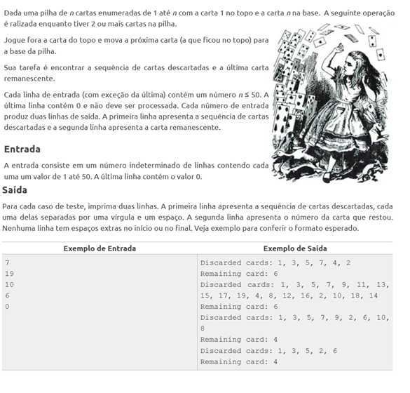

# AVALIAÇÃO A1 ESTRUTURA DE DADOS IESB 2020

#### Questão 1: Dada uma expressão qualquer com parênteses, indique se a quantidade de parênteses está correta ou não, sem levar em conta o restante da expressão. Por exemplo:

> a+(b*c)-2-a **está correto**

>(a+b*(2-c)-2+a)*2 **está correto**

**enquanto**

> (a*b-(2+c)  **está incorreto**

> 2*(3-a))   **está incorreto**

> )3+b*(2-c)(  **está incorreto**

---

#### Questão 2:

---

#### Questão 3: Implemente uma lista ligada e adicione uma opção que busque um número dentro da lista e mostre o valor do registro imediatamente anterior e do imediatamente posterior.
---
#### Questão 4: Implemente uma lista duplamente ligada e adicione uma opção que remova todos os números primos dessa lista.

---
#### Questão 5: Elabore um método para manter duas pilhas dentro de um único vetor linear $[spacesize] de modo que nenhuma das pilhas incorra em estouro até que toda a memória seja usada, e uma pilha inteira nunca seja deslocada para outro local dentro do vetor. Escreva rotinas em C, push1, push2, pop1 e pop2, para manipular as duas pilhas. (Dica: as duas pilhas crescem na direção da outra.)

---
#### Questão 6:
#### *a)* Escreva um algoritmo para determinar se uma string de caracteres de entrada é da forma:
**xCy**

#### onde x é uma string consistindo nas letras 'A' e 'B', e y é o inverso de x (isto é, se x = "ABABBA", y deve equivaler a "ABBABA"). Em cada ponto, você só poderá ler o próximo caractere da string.

#### *b)* Escreva um algoritmo para determinar se uma string de caracteres de entrada é da forma:
**a D b D c D...D z**

#### onde cada string, a, 6, ..., z, é da forma da string definida no Exercício 2.1.3. (Por conseguinte, uma string estará no formato correto se consistir em qualquer número de strings desse tipo, separadas pelo caractere 'D'.) Em cada ponto, você só poderá ler o próximo caractere da string.

---

#### Questão 7: Implemente uma fila circular utilizando uma estrutura de lista ligada.
